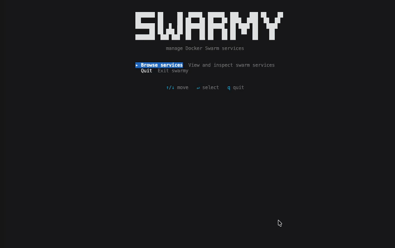

swarmy is a command-line tool (Terminal UI) that allows you to manage Docker swarm services and containers easily.




## Installation

### Homebrew

```bash
brew install alexcastrodev/swarmy/swarmy
```

### Script

```bash
curl -sSL https://raw.githubusercontent.com/alexcastrodev/swarmy/main/install.sh | bash
```


# Usage

```bash
swarmy
```

- Show all service
- You see the services with their name, replicas, image, and ports.
- You can enter the service name to see more details about it.
- You can see why a service is not running in details.
- You can also filter the services by name using the `--filter` option.

# Release

```bash
$ make install
```

# Debug

```bash
$ make run
```

# Technologies

- [Crystal language](https://crystal-lang.org/)
